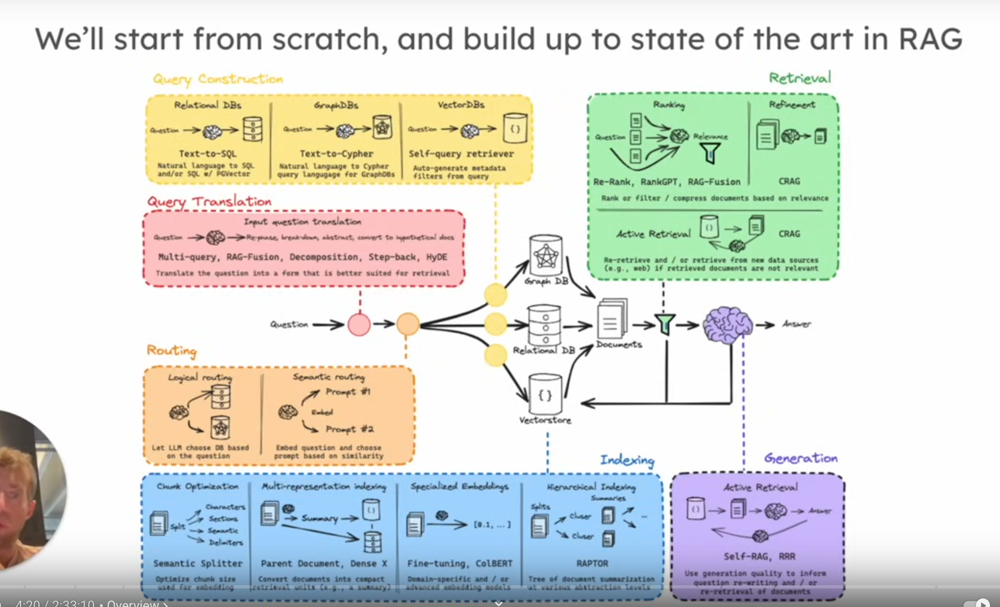

# RAG Overview:

[Github Code](https://github.com/langchain-ai/rag-from-scratch/blob/main/rag_from_scratch_1_to_4.ipynb)

RAG involves three main steps:

1. **Indexing**: Building a database (e.g., Vector Store) to store and organize external data.
2. **Retrieval**: Retrieving relevant documents from the database based on a given input (e.g., a question).
3. **Generation**: Using an LLM to generate an answer based on the retrieved information.

## Overall Architecture : 

### Query Translation : 
1. **Rewriting**: Modifying the original question to improve retrieval.
2. **Sub-questions**: Breaking down the question into smaller sub-problems.
3. **Step-back Prompting**: Asking a more abstract question to guide retrieval.
4. **Multi-Question**: Asking multiple similar questions.
5. **RAG Fusion** : Retrieve multiple documents and rank them and then pass all or only the top based on requirements. 
6. **HyDe** : We create a sample answer to the question and use that for retrieval instead of the question.
### Routing
### Query Construction 
### Retrieval
### Generation

### Indexing : 
1. **Direct Indexing** : Split document into smaller documents. Create vector representation for each. 
2. **Multi-Representation**: Split document into smaller documents. Create a crisp summary and save that in the vector store and use that for efficient document retrieval. Usually document is stored in a document store and then summaries of each is stored in vector db and it is linked and then used that for retrieval. 
3. **RAPTOR**: Create a hierarchial indexing. Create a hierarchy for chunks and all of them are stored and based on the question, right summary can be used for answering questions. Starts from a leaf document and attach all the summaries and this is then used for retrieval. Especially important if information is stored accross documents and not just 1 document. 

4. **ColBERT**: Each word/token is converted into a embedding. When a question comes in, even that is broken down to each token and embedding is created for each. Then similarity for each token in the question is added up and max is taken. 

## Various RAG Approaches : 
1. 