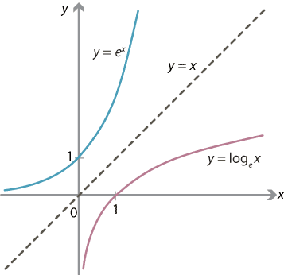
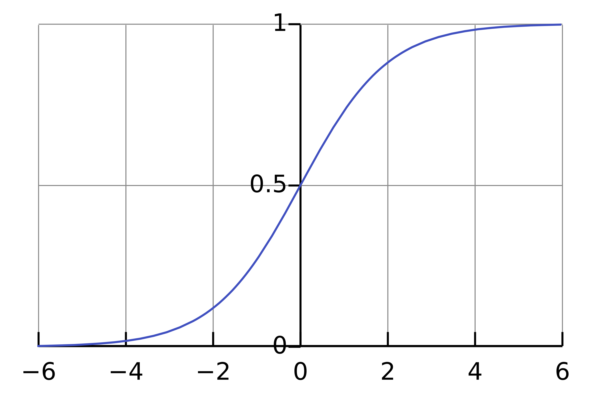

Natural Exponent and Logarithm : e^x and ln(x). 
Interpretation 1 : Growth and decay.

Absolute Value : |x|.
Interpretation 1 : Always positive. Symmetric function. 
Interpretation 2 : Distance from the origin. 

Logistic Function : f(x) = 1 / (1 + e^-x).
Interpretation 1 : S-shaped curve.

Rank : [10,20,15,30] -> 1,3,2,4.
Tied Rank : [10,20,20,30] -> 1,3.5,3.5,4. If there are similar numbers, then avg of their ranks is assigned to all similar numbers. In this case (2 + 3) / 2. 
